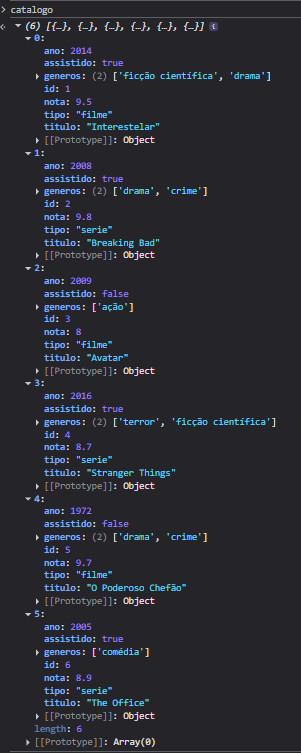
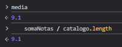
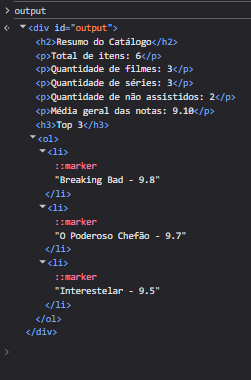

# Trabalho Prático - Semana 8

Nesta atividade, você fazer exercícios de programação para vai praticar a manipulação de objetos e arrays em JavaScript, passando pela definição de dados em notação **JSON (JavaScript Object Notation)**, acessando propriedades e itens, e usando iterators para processar os dados e gerar resultados.

## Informações Gerais

- Nome: Tiago Malta Leão
- Matricula: 918189

## Prints do console do navegador

<<  COLOQUE A IMAGEM - LISTAGEM DE TÍTULOS - ](image.png) >>

<<  COLOQUE A IMAGEM - CÁLCULO DE MÉDIAS -  >>

<<  COLOQUE A IMAGEM - PÁGINA COM O RESUMO -  >>
